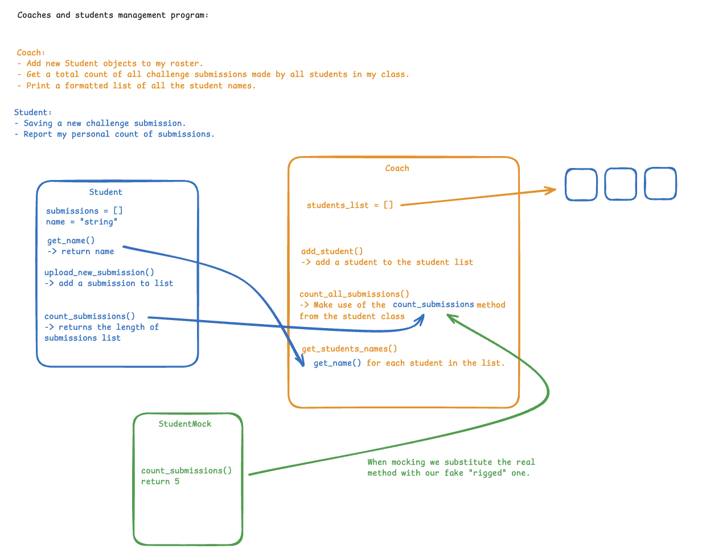
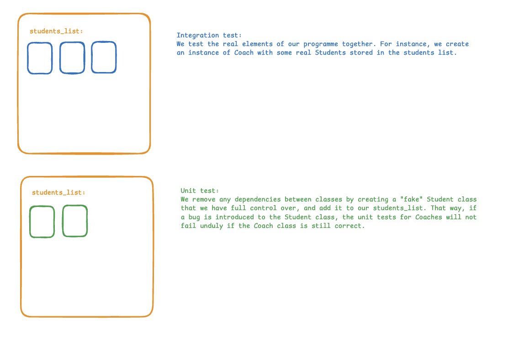

# 🧑‍🏫 Coach & Student Management System

This project demonstrates a simple multi-class system in Python, built with clean Object-Oriented Programming (OOP) principles and comprehensive testing. It is structured for learners to practice class design, composition, and testing strategies.

## 🚀 Learning Objectives

- Learn about the benefits of OOP. 

- Use a diagram to understand better how to build a multi-class system.

- TDDing methods in a multi-class system. 

## 📂 Project Structure
```bash
.
├── lib/
│   ├── coach.py        # Contains the Coach class
│   └── student.py      # Contains the Student class
└── tests/
    ├── test_coach_integration.py   # Tests the interaction between Student and Coach classes
    └── test_coach_unit.py    # Tests the Coach class in isolation
```
---

## Project Diagram




## 🧪 Running the Tests

The project uses `pytest` for running automated tests.

1.  Run all tests from the project root:

    ```bash
    pytest -xv
    ```
